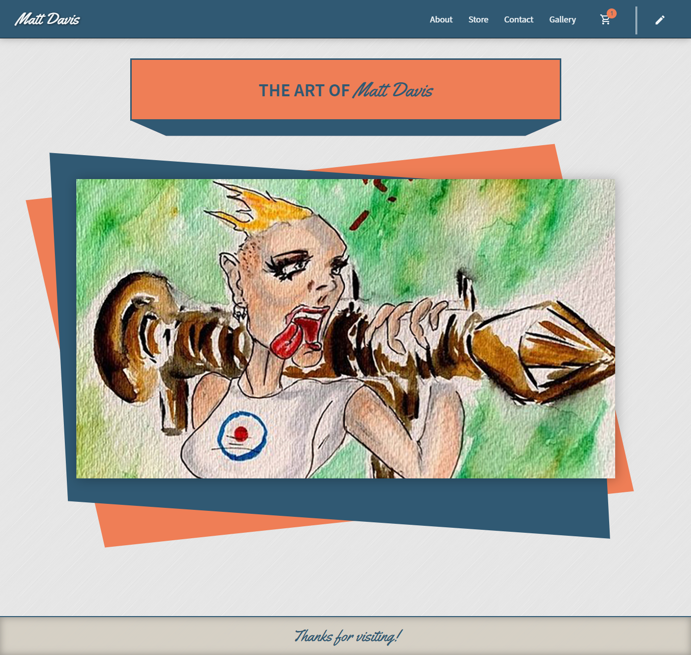
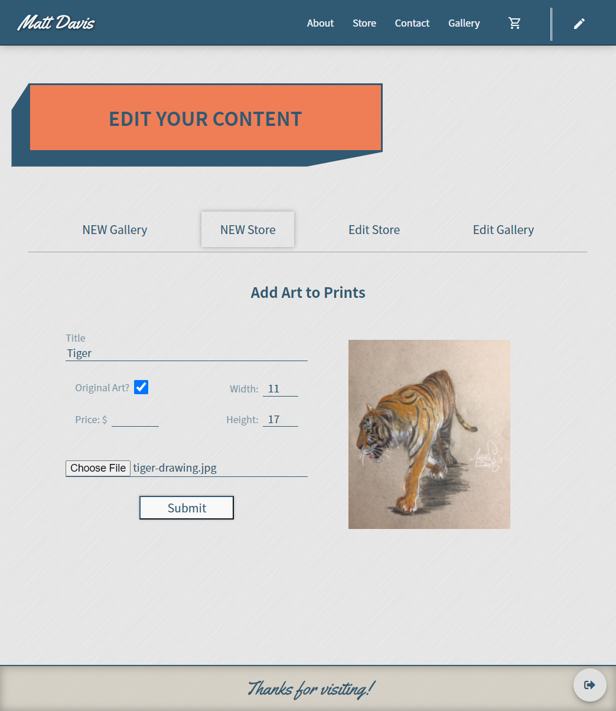
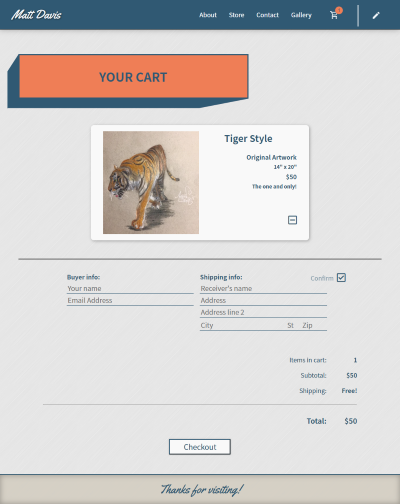
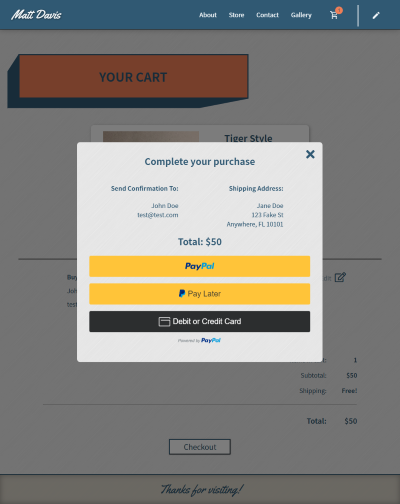

# Artist site for Matt Davis

A full stack, ecommerce application for an artist to sell prints and original artwork, as well as display a gallery of his favorite works.

### Technologies:

- MongoDB
- Express
- React.js
- Node.js
- Google Cloud Storage

## Description of application

Using React front-end framework to consume data from MongoDB by way of a Node.js API, this app offers the client (Matt Davis) complete control over his store content, and his gallery of works.

The checkout flow is entirely custom, and makes use of the PayPal API to process payments. Users can select items to add to the cart, edit quantities and shipping info, then proceed to the embedded PayPal Checkout.

### Hosting

The current version of this site can found at https://artistmattdavis.com
